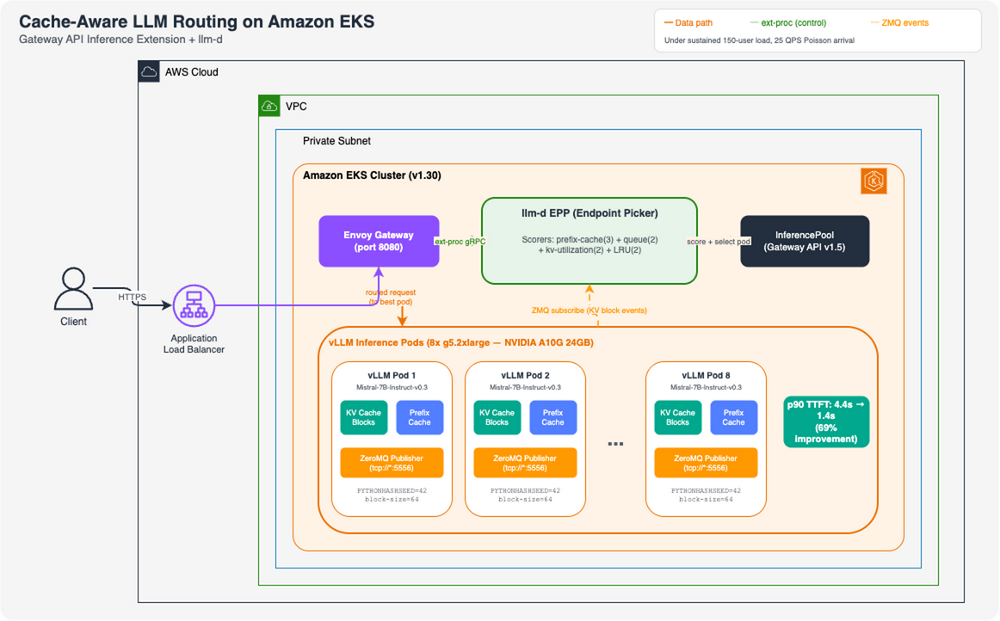
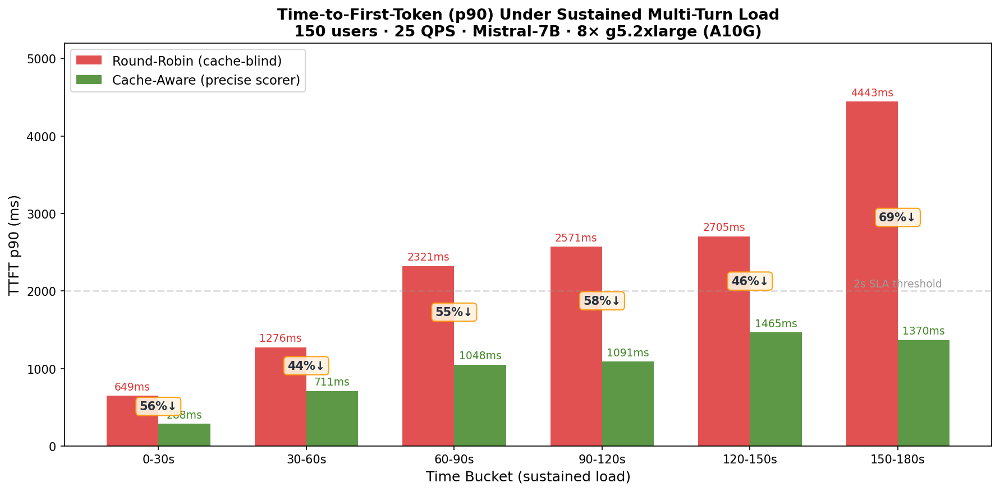

# Cache-Aware LLM Routing on Amazon EKS with Gateway API Inference Extension and llm-d



> Editable source: [`architecture.drawio`](./architecture.drawio)

This sample demonstrates how to deploy precise KV-cache-aware inference routing on [Amazon EKS](https://aws.amazon.com/eks/) using the [Kubernetes Gateway API Inference Extension](https://gateway-api-inference-extension.sigs.k8s.io/) and [llm-d](https://llm-d.ai/), reducing tail latency (p90 TTFT) by up to 69% compared to standard round-robin routing under sustained multi-turn load.



## Table of Contents

- [Features](#features)
- [Overview](#overview)
- [Architecture](#architecture)
- [Benchmark Results](#benchmark-results)
- [Prerequisites](#prerequisites)
- [Deployment](#deployment)
- [Running the Benchmark](#running-the-benchmark)
- [Cost](#cost)
- [Cleanup](#cleanup)
- [Key Configuration Details](#key-configuration-details)
- [Security](#security)
- [Contributing](#contributing)
- [Learn More](#learn-more)
- [License](#license)

## Features

- [x] Precise KV-cache-aware routing using real-time ZeroMQ KV block events
- [x] Gateway API Inference Extension (InferencePool v1 GA) integration
- [x] Multi-scorer pipeline: prefix-cache(3) + queue(2) + kv-utilization(2) + LRU(2)
- [x] vLLM with prefix caching and deterministic block hashing
- [x] Automated sustained benchmark with Poisson arrival pattern
- [x] One-command deployment and cleanup scripts
- [x] Model-agnostic design (works with any vLLM-served model)
- [x] No model or application code changes required

## Overview

When serving LLMs at scale with multiple replicas, standard Kubernetes load balancing scatters requests across pods without awareness of GPU KV-cache state. This forces each pod to recompute the KV-cache for shared prompt prefixes from scratch — wasting GPU cycles and increasing time-to-first-token (TTFT).

Cache-aware routing solves this by maintaining a real-time global index of which KV-cache blocks reside on which pod, and routing each request to the pod with the highest prefix-cache affinity.

## Architecture

### How It Works

1. **vLLM pods publish KV-cache events** over ZeroMQ on every block allocation/eviction
2. **llm-d EPP subscribes per pod** via pod discovery, building a global prefix-block index
3. **On each request**, the EPP tokenizes the prompt, looks up which pods hold matching blocks, and routes to the pod with the highest cache hit fraction

### Request Flow

```
Client
  → Application Load Balancer (external ingress)
    → Envoy Gateway (port 8080)
      → ext-proc gRPC → llm-d EPP (Endpoint Picker)
        EPP scores pods: precise-prefix-cache(3) + queue(2) + kv-util(2)
      ← routing decision (selected pod IP)
    → Envoy forwards to chosen vLLM pod (port 8000)
      → vLLM processes with prefix caching + KVEvents publishing
  ← streaming response
```

### Components

| Component | Role | Version |
|-----------|------|---------|
| [Amazon EKS](https://aws.amazon.com/eks/) | Kubernetes control plane | v1.30 |
| [vLLM](https://docs.vllm.ai/) | LLM inference engine with prefix caching | v0.22+ |
| [Envoy Gateway](https://gateway.envoyproxy.io/) | L7 proxy with ext-proc support | v1.2.0 |
| [llm-d](https://llm-d.ai/) | Cache-aware request scheduler (CNCF Sandbox) | v0 |
| [Gateway API Inference Extension](https://gateway-api-inference-extension.sigs.k8s.io/) | InferencePool CRD | v1.5.0 |

## Benchmark Results

**Configuration**: 150 concurrent users, 25 QPS (Poisson arrival), 8× vLLM pods (Mistral-7B on [Amazon EC2 G5](https://aws.amazon.com/ec2/instance-types/g5/)), 3-minute sustained multi-turn load.

| Time Bucket | Round-Robin p90 | Cache-Aware p90 | Improvement |
|-------------|-----------------|-----------------|-------------|
| 0–30s       | 649ms           | 288ms           | **+56%**    |
| 30–60s      | 1,276ms         | 711ms           | **+44%**    |
| 60–90s      | 2,321ms         | 1,048ms         | **+55%**    |
| 90–120s     | 2,571ms         | 1,091ms         | **+58%**    |
| 120–150s    | 2,705ms         | 1,465ms         | **+46%**    |
| 150–180s    | 4,443ms         | 1,370ms         | **+69%**    |

> [!IMPORTANT]
> Round-robin TTFT degrades to **4.4 seconds** under sustained load while cache-aware routing holds at **1.4 seconds**.

## Prerequisites

- AWS account with permissions for [Amazon EKS](https://aws.amazon.com/eks/), [Amazon EC2](https://aws.amazon.com/ec2/) (GPU instances), and [Elastic Load Balancing](https://aws.amazon.com/elasticloadbalancing/)
- [AWS CLI v2](https://docs.aws.amazon.com/cli/latest/userguide/getting-started-install.html) configured
- [kubectl](https://kubernetes.io/docs/tasks/tools/) v1.30+
- [Helm](https://helm.sh/docs/intro/install/) v3.12+
- [eksctl](https://eksctl.io/installation/) v0.170+
- A [Hugging Face token](https://huggingface.co/settings/tokens) with access to `mistralai/Mistral-7B-Instruct-v0.3`
- Service quota for 8× `g5.2xlarge` instances in your target region

## Deployment

### One-Command Deploy (~25 minutes)

```bash
export HF_TOKEN=<your-huggingface-token>
./scripts/setup.sh
```

### Step-by-Step Deployment

#### 1. Create EKS Cluster (~15 minutes)

```bash
export AWS_REGION=us-west-2
export CLUSTER_NAME=cache-routing-benchmark

eksctl create cluster -f manifests/cluster.yaml
```

#### 2. Deploy vLLM with KVEvents (~5 minutes for model loading)

```bash
# Create HuggingFace token secret
kubectl -n inference create secret generic hf-token \
  --from-literal=token=$HF_TOKEN

# Deploy vLLM (8 replicas with prefix caching + ZMQ KVEvents)
kubectl apply -f manifests/vllm-deployment.yaml

# Wait for pods to be ready
kubectl -n inference wait --for=condition=Ready pod -l app=vllm-inference --timeout=600s
```

Expected output:
```
pod/vllm-inference-xxx condition met
pod/vllm-inference-xxx condition met
...
```

#### 3. Install Gateway API and Envoy Gateway (~3 minutes)

```bash
# Gateway API CRDs
kubectl apply -f https://github.com/kubernetes-sigs/gateway-api-inference-extension/releases/download/v1.5.0/install.yaml

# Envoy Gateway
helm install eg oci://docker.io/envoyproxy/gateway-helm \
  --version v1.2.0 -n envoy-gateway-system --create-namespace

# Gateway and GatewayClass
kubectl apply -f manifests/gateway.yaml
```

#### 4. Deploy llm-d Router with Precise Scorer (~2 minutes)

```bash
# Create HF token for tokenizer sidecar
kubectl -n inference create secret generic llm-d-hf-token \
  --from-literal=HF_TOKEN=$HF_TOKEN

# Deploy via Helm
helm install cache-aware-routing \
  oci://ghcr.io/llm-d/charts/llm-d-router-gateway-dev \
  --version v0 -n inference \
  -f manifests/llm-d-router-values.yaml
```

Expected output:
```
Release "cache-aware-routing" has been installed. Happy Helming!
```

> [!NOTE]
> Allow ~30 seconds after EPP starts for ZMQ subscribers to connect to all vLLM pods.

## Running the Benchmark

```bash
# Deploy benchmark runner
kubectl apply -f manifests/benchmark-runner.yaml
kubectl -n inference wait --for=condition=Ready pod/benchmark-runner --timeout=120s

# Install dependencies
kubectl -n inference exec benchmark-runner -- pip install aiohttp --quiet

# Copy and run benchmark (~12 minutes: 5 min per path + cooldown)
kubectl cp benchmarks/sustained_benchmark.py inference/benchmark-runner:/tmp/bench.py
kubectl -n inference exec benchmark-runner -- python3 /tmp/bench.py
```

## Cost

> [!CAUTION]
> This sample provisions GPU instances that incur significant cost. Use the cleanup script to tear down all resources immediately after benchmarking.

### Resources Deployed

| Resource | Type | Quantity |
|----------|------|----------|
| [Amazon EKS](https://aws.amazon.com/eks/pricing/) cluster | Control plane | 1 |
| [Amazon EC2 G5](https://aws.amazon.com/ec2/instance-types/g5/) instances | g5.2xlarge (NVIDIA A10G 24GB) | 8 |
| [NAT Gateway](https://aws.amazon.com/vpc/pricing/) | - | 1 |
| [Application Load Balancer](https://aws.amazon.com/elasticloadbalancing/pricing/) | - | 1 |
| [Amazon EBS](https://aws.amazon.com/ebs/pricing/) volumes | gp3, 100GB each | 8 |

Use the [AWS Pricing Calculator](https://calculator.aws/) to estimate costs for your region. We recommend setting up a [billing alarm](https://docs.aws.amazon.com/AmazonCloudWatch/latest/monitoring/monitor_estimated_charges_with_cloudwatch.html) before deployment.

The benchmark itself takes ~15 minutes to run end-to-end.

## Cleanup

```bash
# Delete all resources (stops billing)
./scripts/cleanup.sh

# Or manually:
eksctl delete cluster --name $CLUSTER_NAME --region $AWS_REGION
```

## Key Configuration Details

### vLLM Args (KVEvents Publishing)

```yaml
args:
  - --enable-prefix-caching
  - --prefix-caching-hash-algo sha256_cbor
  - --block-size 64
  - --kv-events-config '{"enable_kv_cache_events":true,"publisher":"zmq",
      "endpoint":"tcp://$(POD_IP):5556",
      "topic":"kv@$(POD_IP):8000@mistralai/Mistral-7B-Instruct-v0.3"}'
env:
  - name: PYTHONHASHSEED
    value: "42"   # Must match EPP tokenProcessorConfig
```

### llm-d Scorer Plugins

```yaml
plugins:
  - type: token-producer          # Tokenizes prompts for hash lookup
  - type: endpoint-notification-source  # ZMQ subscriber per vLLM pod
  - type: precise-prefix-cache-producer
    parameters:
      tokenProcessorConfig:
        blockSize: 64             # Must match vLLM --block-size
      kvEventsConfig:
        discoverPods: true
        podDiscoveryConfig:
          socketPort: 5556        # vLLM ZMQ bind port
  - type: prefix-cache-scorer
    parameters:
      prefixMatchInfoProducerName: precise-prefix-cache-producer
  - type: kv-cache-utilization-scorer
  - type: queue-scorer
```

> [!NOTE]
> `blockSize` and `PYTHONHASHSEED` must match between vLLM and EPP configuration. Mismatches will cause hash collisions and incorrect routing decisions.

## Security

See [CONTRIBUTING](CONTRIBUTING.md#security-issue-notifications) for information on reporting security issues.

This sample implements the following security hardening measures:

- **Private cluster**: EKS API server endpoint is private (VPC-only access)
- **Private subnets**: GPU nodes deployed with `privateNetworking: true` — no public IPs
- **Secrets encryption**: Kubernetes secrets encrypted at rest with AWS KMS (`secretsEncryption.keyARN`)
- **Control-plane audit logging**: API, audit, authenticator, controller-manager, and scheduler logs enabled via CloudWatch
- **TLS on EPP**: ext-proc gRPC served over TLS (`--secure-serving=true`)
- **Metrics auth enabled**: EPP metrics endpoint requires authentication (`--metrics-endpoint-auth=true`)
- **Non-root containers**: All pods run as non-root (UID 1000) with `allowPrivilegeEscalation: false` and `drop: ALL` capabilities
- **CPU/memory limits**: Resource limits set on all containers to prevent noisy-neighbor effects
- **ZMQ endpoint restricted**: KV-events ZMQ binds to pod IP only (`tcp://$(POD_IP):5556`), not all interfaces; NetworkPolicy restricts port 5556 to EPP pods
- **HF token via env from Secret**: Model token injected as environment variable from Kubernetes Secret — never exposed in process args
- **No inline shell substitution**: Setup script uses variable assignment before use (no command substitution inside `kubectl exec`)

> [!NOTE]
> For production deployments, consider additionally:
> - Using [AWS Secrets Manager CSI driver](https://docs.aws.amazon.com/secretsmanager/latest/userguide/integrating_csi_driver.html) instead of native Kubernetes Secrets
> - Enabling [Amazon GuardDuty for EKS](https://docs.aws.amazon.com/guardduty/latest/ug/guardduty-eks-audit-log-monitoring.html)
> - Adding Pod Security Standards (`restricted` profile) at the namespace level

## Contributing

We welcome contributions! See [CONTRIBUTING.md](CONTRIBUTING.md) for guidelines on how to report issues, suggest features, or submit pull requests.

## Learn More

| Resource | Description |
|----------|-------------|
| [llm-d Documentation](https://llm-d.ai/docs/getting-started) | Getting started with llm-d |
| [Precise Prefix Cache Routing Guide](https://github.com/llm-d/llm-d/blob/main/guides/precise-prefix-cache-routing/README.md) | Official llm-d deployment guide |
| [Gateway API Inference Extension](https://gateway-api-inference-extension.sigs.k8s.io/) | Kubernetes SIG docs |
| [vLLM Automatic Prefix Caching](https://docs.vllm.ai/en/latest/features/automatic_prefix_caching.html) | How prefix caching works |
| [Amazon EKS User Guide](https://docs.aws.amazon.com/eks/latest/userguide/) | EKS documentation |
| [KV-Cache Wins You Can See](https://llm-d.ai/blog/kvcache-wins-you-can-see) | llm-d technical deep-dive blog |

## License

This library is licensed under the MIT-0 License. See the [LICENSE](LICENSE) file.
